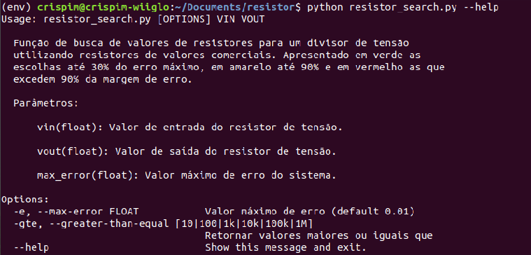
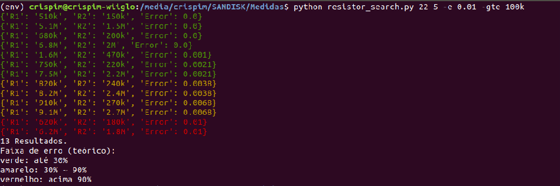

Medidas Elétricas e Magnéticas
*******************************
Código para cálculo de um divisor de tensão através dos dados de entrada e saída desejados.

--------------------------

Criação de um ambiente virtual
===============================
Linux
-----
* sudo apt install pipenv
* pipenv install
* pipenv shell

Windows
-------
* pip install pipenv
* pipenv install
* pipenv shell

Instalando dependências
========================
* $ pipenv install Pipfile

Utilização do comando
========================
* $ python resistor_search.py <valor tensão entrada> <valor de tensão saída>

Para mais informações
========================
* $ python resistor_search.py --help
